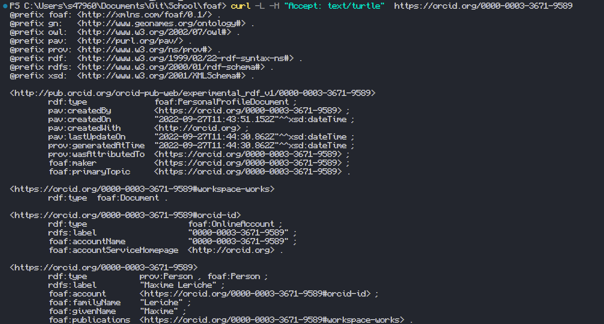

# Foaf

## Exercice 1

Afin d'allez plus loin deux lien sont a uttilisé:

- [Repo Github](https://github.com/batleforc/foaf)
- [Site Web github pages](https://batleforc.github.io/foaf/)
- [Validation W3C](https://www.w3.org/RDF/Validator/rdfval?URI=https%3A%2F%2Fbatleforc.github.io%2Ffoaf%2Ffoaf.rdf&PARSE=Parse+URI%3A+&TRIPLES_AND_GRAPH=PRINT_TRIPLES&FORMAT=PNG_EMBED)

Le lien du site web correspond a exposé de maniére statique le contenue du repo. Pour cela il faut que le repo soit public et rend accessible le fichier foaf.rdf a l'addresse suivante [foaf.rdf](https://batleforc.github.io/foaf/foaf.rdf).

L'associatin vers la homepage est effectué via les méta présent dans Html > Head et ce a l'aide d'une balise Link.

## Exercice 2

Afin de définir un rendu xhtml pour notre rdf celui un fichier aux format xslt (ici stylesheet.xslt) qui permettrat de rendre les donnée aux bon format. ce fichier est importer dans rdf via `<?xml-stylesheet type="text/xsl" href="stylesheet.xslt"?>` ce qui dans un navigateur permettra de rendre le rdf en xhtml.

```xslt
<?xml version="1.0"?>
<xsl:stylesheet version="1.0" xmlns:rdf="http://www.w3.org/1999/02/22-rdf-syntax-ns#" xmlns:xsl="http://www.w3.org/1999/XSL/Transform" xmlns:foaf="http://xmlns.com/foaf/0.1/">
  <xsl:output method="html" indent="yes" />
  <xsl:template match="rdf:RDF/foaf:Person">
    <h1>
      <xsl:value-of select="foaf:title" />
      <xsl:value-of select="foaf:name" />
    </h1>
    <p>
      Pseudo
      <xsl:value-of select="foaf:nick" />
    </p>
    <p>
      Homepage
      <xsl:value-of select="foaf:homepage" />
    </p>
    <div>
      <ul>
        <xsl:for-each select="foaf:knows">
          <li>
            <xsl:value-of select="foaf:Person/foaf:name" />
          </li>
        </xsl:for-each>
      </ul>
    </div>
  </xsl:template>
</xsl:stylesheet>
```

## Exercice 3

A l'aide de la commande cURL, il est possible de récupérer son profil orcid aux format turtle en lui indiquant un header acceptant le format turtle.

```bash
curl -L -H "Accept: text/turtle" https://orcid.org/0000-0003-3671-9589
```



En cas de besoin ce contenue peut dirrectement être copié dans un fichier .ttl .

## Exerciec 4

Aucun n'est retournée par la commande java suivante. Celle ci devrais a partir de foaf2 qui est un fichier rdf fournit par le tp retourner une liste de personne qui sont en relation avec la personne de foaf2.

```bash
java -jar ./ldspider-1.3-with-dependencies.jar -s ./foaf2.rdf -d result -mr 10
```
